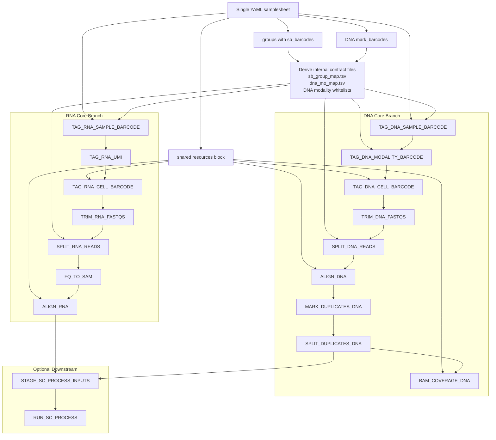

# Implemented Pipeline Architecture

Repo-maintained architecture view for the current implementation.

- Core workflow: RNA through `ALIGN_RNA`, DNA through `BAM_COVERAGE_DNA`
- Optional downstream: shared staging plus one optional `sc_process.py` path

Notes:

- RNA and DNA stay independent and parallel until the optional shared downstream boundary.
- The core workflow does not require `sc_process.py`.
- Shared run resources such as `ligation_barcode_whitelist`, `rna_ref_base_dir`, `dna_bwa_reference`, `dna_blacklist_bed`, and `dna_effective_genome_size` now live in the top-level YAML `resources` block.
- `rna_align_species` also lives in the top-level YAML `resources` block and is used for RNA alignment and optional shared downstream staging.
- `sb_group_map.tsv`, `dna_mo_map.tsv`, and DNA modality whitelist files are derived internally from the hierarchical YAML.
- The core runtime scripts are repo-owned under `scripts/core_runtime/`.
- The optional downstream `sc_process.py` path remains separate by design.
