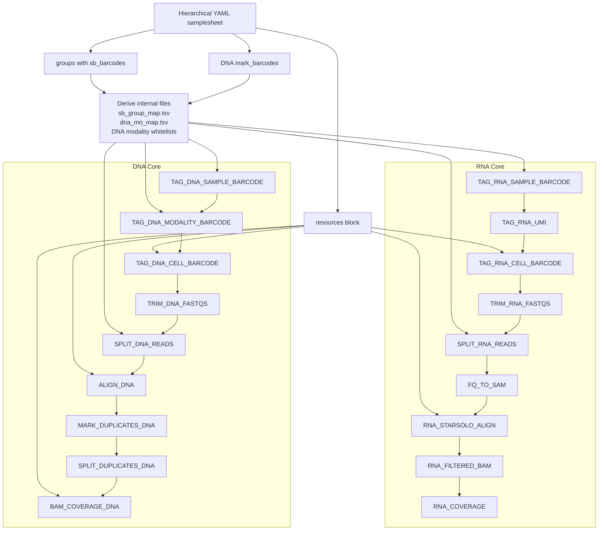

# Implemented Pipeline Architecture

Core workflow only:

- RNA through the repo-owned STARsolo, filtered-BAM, and coverage stages
- DNA through `BAM_COVERAGE_DNA`

Notes:

- One hierarchical samplesheet can describe RNA-only, DNA-only, or combined runs.
- RNA and DNA remain independent branches in the same workflow.
- The supported public contract is the hierarchical YAML samplesheet only.
- `sb_group_map.tsv`, `dna_mo_map.tsv`, and DNA modality whitelist files are internal artifacts, not user inputs.
- The core runtime scripts are repo-owned under [`scripts/core_runtime/`](/mnt/dataFast/ahrmad/tresflowdir/TrESFlow/scripts/core_runtime).
