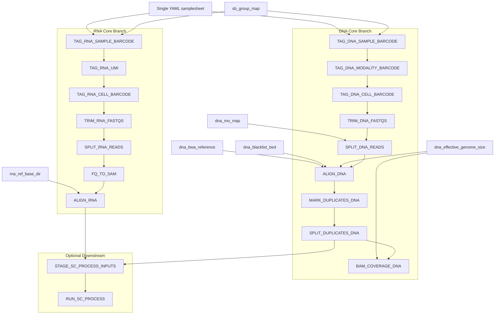

# Implemented Pipeline Architecture

This is the repo-maintained architecture view for the **currently implemented**
TrESFlow workflow on this server.

- Core workflow:
  - RNA through `ALIGN_RNA`
  - DNA through `BAM_COVERAGE_DNA`
- Optional downstream:
  - shared staging
  - one optional `sc_process.py` path

Notes:

- RNA and DNA stay independent and parallel until the optional shared downstream boundary.
- The core workflow does not require `sc_process.py`.
- The core runtime scripts are repo-owned under `scripts/core_runtime/`.
- The optional downstream `sc_process.py` path remains separate by design.
