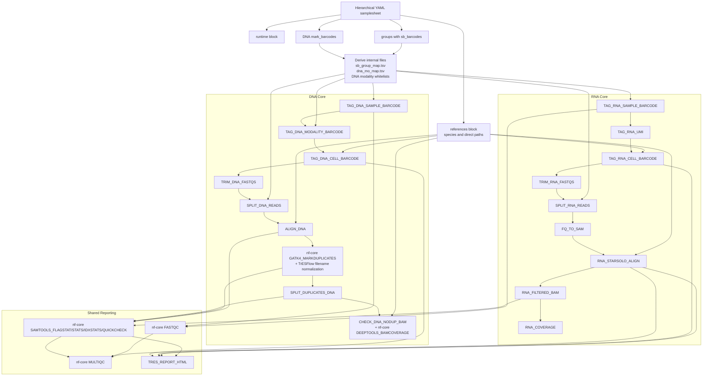

# Implemented Pipeline Architecture

Core workflow only:

- RNA through the repo-owned STARsolo, filtered-BAM, and coverage stages
- DNA through repo-owned tagging/splitting/alignment, nf-core `gatk4/markduplicates`, repo-owned NoDup extraction, and nf-core `deeptools/bamcoverage`
- nf-core FastQC/samtools sidecar QC, nf-core MultiQC, and a TrESFlow-specific HTML report at the end of the run

```mermaid
flowchart TD
    SS[Hierarchical YAML samplesheet]
    RUN[runtime block]
    REF[references block\nspecies and direct paths]
    GROUPS[groups with sb_barcodes]
    DNAMARKS[DNA mark_barcodes]
    DERIVE[Derive internal files\nsb_group_map.tsv\ndna_mo_map.tsv\nDNA modality whitelists]

    SS --> RUN
    SS --> REF
    SS --> GROUPS
    SS --> DNAMARKS
    GROUPS --> DERIVE
    DNAMARKS --> DERIVE

    REF --> RNA2
    REF --> RNA6
    REF --> DNA2
    REF --> DNA5
    REF --> DNA8
    DERIVE --> RNA0
    DERIVE --> RNA4
    DERIVE --> DNA0
    DERIVE --> DNA1
    DERIVE --> DNA4

    subgraph RNA_Core[RNA Core]
        RNA0[TAG_RNA_SAMPLE_BARCODE]
        RNA1[TAG_RNA_UMI]
        RNA2[TAG_RNA_CELL_BARCODE]
        RNA3[TRIM_RNA_FASTQS]
        RNA4[SPLIT_RNA_READS]
        RNA5[FQ_TO_SAM]
        RNA6[RNA_STARSOLO_ALIGN]
        RNA7[RNA_FILTERED_BAM]
        RNA8[RNA_COVERAGE]
        RNA0 --> RNA1 --> RNA2 --> RNA3 --> RNA4 --> RNA5 --> RNA6 --> RNA7 --> RNA8
    end

    subgraph DNA_Core[DNA Core]
        DNA0[TAG_DNA_SAMPLE_BARCODE]
        DNA1[TAG_DNA_MODALITY_BARCODE]
        DNA2[TAG_DNA_CELL_BARCODE]
        DNA3[TRIM_DNA_FASTQS]
        DNA4[SPLIT_DNA_READS]
        DNA5[ALIGN_DNA]
        DNA6[nf-core GATK4_MARKDUPLICATES\n+ TrESFlow filename normalization]
        DNA7[SPLIT_DUPLICATES_DNA]
        DNA8[CHECK_DNA_NODUP_BAM\n+ nf-core DEEPTOOLS_BAMCOVERAGE]
        DNA0 --> DNA1 --> DNA2 --> DNA3 --> DNA4 --> DNA5 --> DNA6 --> DNA7 --> DNA8
    end

    subgraph Reporting[Shared Reporting]
        FASTQC[nf-core FASTQC]
        SAMTOOLS[nf-core SAMTOOLS_FLAGSTAT/STATS/IDXSTATS/QUICKCHECK]
        MULTIQC[nf-core MULTIQC]
        TRESHTML[TRES_REPORT_HTML]
    end

    RNA0 --> FASTQC
    RNA7 --> SAMTOOLS
    RNA6 --> MULTIQC
    DNA0 --> FASTQC
    DNA5 --> SAMTOOLS
    DNA6 --> SAMTOOLS
    DNA7 --> SAMTOOLS
    FASTQC --> MULTIQC
    SAMTOOLS --> MULTIQC
    SAMTOOLS --> TRESHTML
    RNA6 --> TRESHTML
    RNA2 --> TRESHTML
    DNA2 --> TRESHTML
```

Notes:

- One hierarchical samplesheet can describe RNA-only, DNA-only, or combined runs.
- `sb_group_map.tsv`, `dna_mo_map.tsv`, and DNA modality whitelist files are internal artifacts, not user inputs.
- `TAG_DNA_CELL_BARCODE` uses DNA `i1` as the ligation source: single reads use starts `15,53,91`; dual reads use starts `41,79,117`.
- nf-core FastQC and samtools modules are sidecar QC readers only; they do not alter downstream TrESFlow outputs.
- nf-core `gatk4/markduplicates` replaces the previous local GATK invocation but preserves `--BARCODE_TAG CB`, `--REMOVE_DUPLICATES false`, index creation, and the historical TrESFlow output names via a normalization adapter.
- nf-core `deeptools/bamcoverage` replaces the previous direct `bamCoverage` call. A repo-owned precheck keeps the previous zero-mapped NoDup BAM behavior by publishing a warning artifact and skipping coverage when needed.
- `TRES_REPORT_HTML` renders `tres_report/tres_report.html` and `tres_report_metrics.json` from existing TrES stats, STARsolo summaries, samtools outputs, and GATK duplicate metrics.
- The active core runtime lives under [`scripts/core_runtime/`](/mnt/dataFast/ahrmad/tresflowdir/TrESFlow/scripts/core_runtime).
